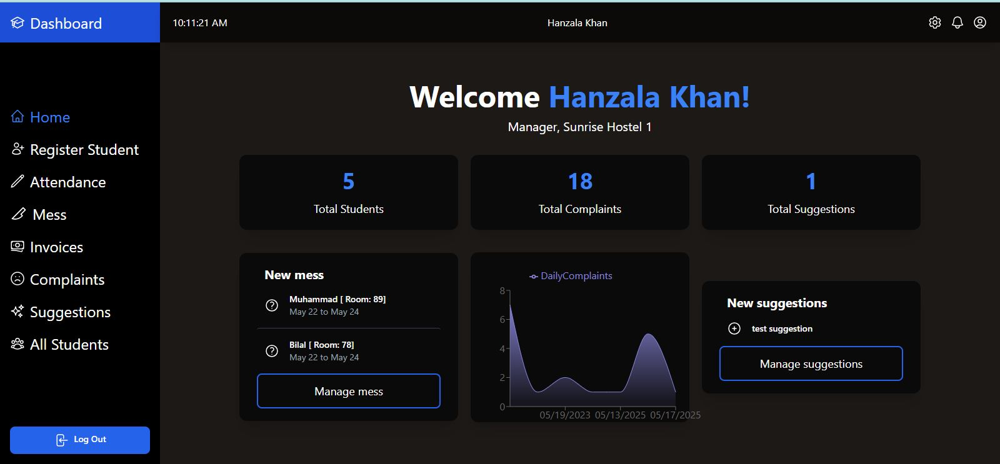
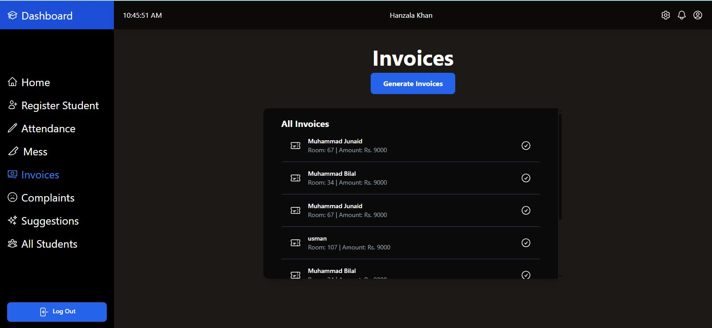
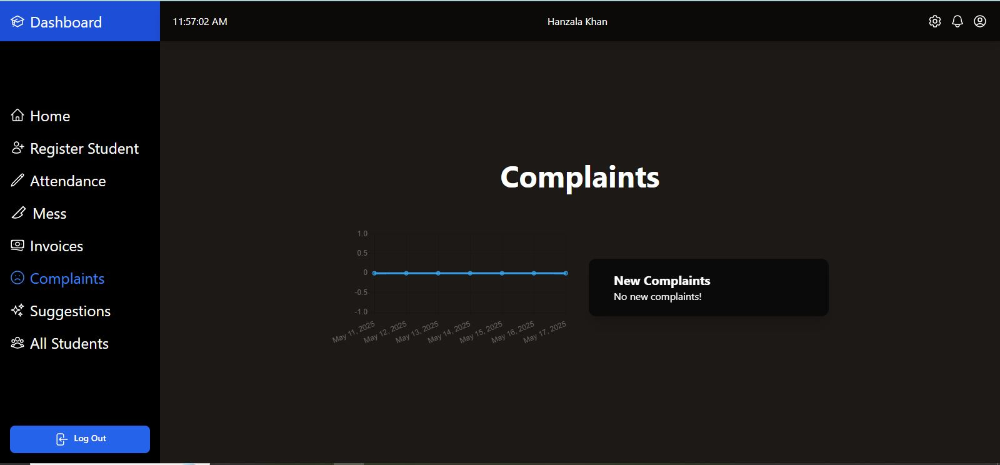
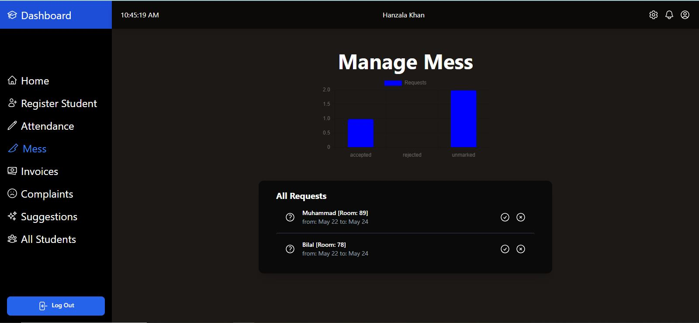
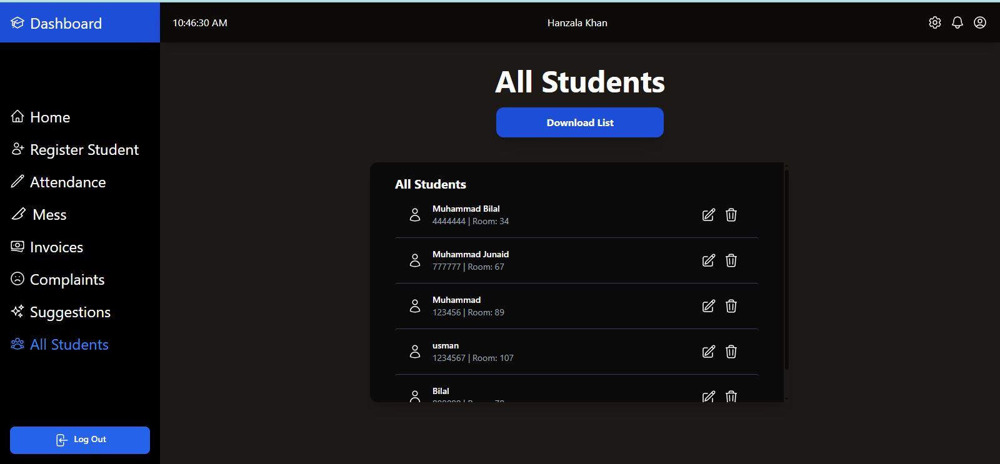
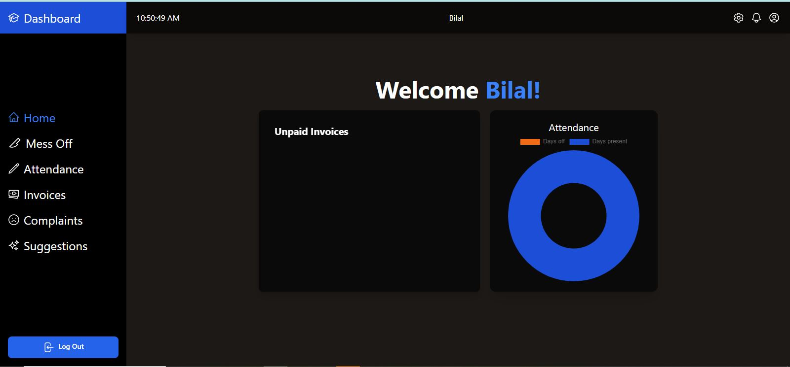
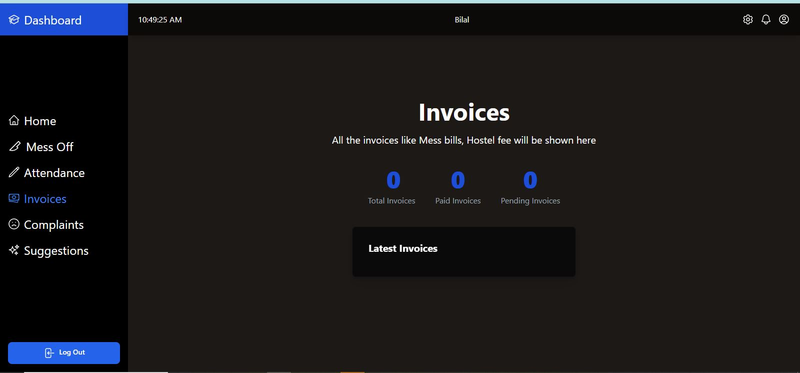
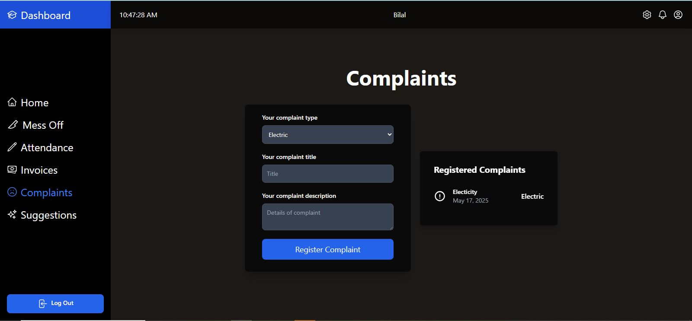

# 🏨 Hostel Management System

A full-stack hostel management system built with the **MERN stack** (MongoDB, Express, React, Node.js), designed to manage both admin and student interactions efficiently.

---

## ✨ Features Overview

- 🔐 **Role-Based Authentication** – Secure login for Admin and Student roles.
- 📋 **Admin Panel** – Register students, manage invoices, mess, complaints, and more.
- 🎓 **Student Panel** – Dashboard for viewing invoices, submitting complaints, and accessing updates.
- 📦 **Modular Design** – Scalable and clean codebase following modern full-stack practices.

---

## 🧑‍💼 Admin Dashboard

Admin has access to full control over system data and functionality.

### 📌 Register Student
Create and manage student records.

---

### 📌 Manage Invoices
Generate and manage invoices for each student.

---

### 📌 View Complaints
See all complaints submitted by students.

---

### 📌 Mess Management
Handle and update mess-related records.

---

### 📌 View All Students
View and search through the complete student list.

---

## 🎓 Student Dashboard

Students can access their personal dashboard to interact with the system.

### 📌 Student Home
Overview of key options and recent updates.

---

### 📌 View Invoices
See all invoices issued by the admin.

---

### 📌 File Complaints
Submit complaints related to hostel, mess, or other issues.

---

---

## 🙌 Thank You!

If you find this project helpful, consider giving it a ⭐ on GitHub!

---

## 🔗 Connect with Me

🔗 **[My LinkedIn – click here](https://www.linkedin.com/in/hanzala-khann)**
